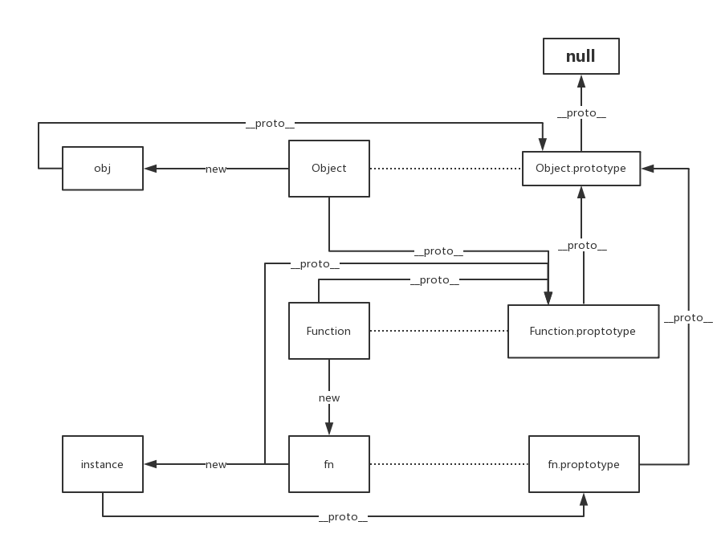

1. js prototype

   

   tip:  1). Object 和 Function 互为实例

2. 进程和线程

   - 进程是计算机最小计算控制单元，拥有独立的虚拟内存地址空间。（进程管理计算机最小的计算资源和存储资源）
   - 一个进程拥有多个线程。这多个线程共享进程的资源。

   

   - Node的单线程
     - 传统request由一个线程处理，即使IO等待，这个线程也没被释放。
     - node的request只由主线程处理，有IO时，直接发起IO处理请求，由底层线程（libuv）处理，主线程再去事件栈中处理其他任务。

   

3. 创建线程的步骤 

   webworker 不具备线程通信，锁等特性，主要用于将数据处理和页面渲染拆分开。

4. TCP为什么3次握手，每个阶段都做什么，和UDP的区别

   TCP三次握手
   第一次：客户端发送SYN给server，客户端进入SYN_SENT
   第二次：server发送ACK和FIN给客户端，server进入SYN_RCVD
   第三次:客户端发送ACK给server，双方进入ESTABLISHED

      TCP四次挥手

      第一次：客户端发送FIN包给server,此时客户端进入FIN_WAIT_1状态
      第二次：server发送ACK给客户端，server进入CLOSE_WAIT
      第三次：server发送FIN给客户端，server进入LAST_ACK
      第四次：客户端发送ACK给server,server进入CLOSED状态

      TCP,UDP区别

      tcp是面向连接的，udp是无连接的
      tcp提供可靠服务，udp尽最大努力交付，但不保证可靠
      udp具有较好的实时性，工作效率比tcp高。
      tcp只能点对点传输，udp可以一对一，一对多，多对多

5. 观察者模式实现 ?

6. http报文头部有哪些字段? 有什么意义 ?

7. 主流框架的数据单向/双向绑定实现原理 ?

8. JSbridge原理, js和native是如何通信的?

9. **解释 JavaScript 并发模型**  （提示：事件循环，任务队列，调用栈，堆等）

10. **客户端 MVC 与服务器端或经典 MVC 有何不同？** 

11. **使函数式编程与面向对象或命令式编程不同的关键因素是什么？**

    提示：Currying（柯里化），point-free 函数，partial function 应用，高阶函数，纯函数，独立副作用，record 类型（联合，代数数据类型）等。

12. **不可变数据结构（immutable data structures）解决了哪些问题？**

    不可变结构是否有任何性能影响？ JS 生态系统中哪些库提供了不可变的数据结构？这些库的优点和缺点是什么？

13. **大型应用程序是否应使用静态类型？**

    如何比较 TypeScript/Flow 与 Elm/ReasonML/PureScript 等 JS 转换语言？这些方法的优缺点是什么？

    选择特定类型系统的主要标准应该是什么？

    什么是类型推断（type inference）？

    静态类型语言和强类型语言有什么区别？在这方面 JavaScript 的本质是什么？

    有你知道的弱类型但静态类型的语言吗？有你知道的动态类型但强类型的语言吗？举例一二。

    提示：Structural 与 Nominal 类型系统，类型稳健性，工具/生态系统支持，正确性超过方便。

14. **JavaScript 中有哪些突出的模块系统（module systems ）？评价 ES 模块系统。**

    列出在实现不同模块系统之间互操作所涉及的一些复杂性问题（主要对 ES 模块和 CommonJS 互操作感兴趣）

15. **什么是sectioning算法？**

    提示：它也被称为 HTML5 大纲算法。特别是在构建具有语义结构的网站时非常重要。

16. **有没有去研究webpack的一些原理和机制，怎么实现的**

    1. 解析webpack配置参数，合并从shell传入和webpack.config.js文件里配置的参数，生产最后的配置结果。
    2. 注册所有配置的插件，好让插件监听webpack构建生命周期的事件节点，以做出对应的反应。
    3. 从配置的entry入口文件开始解析文件构建AST语法树，找出每个文件所依赖的文件，递归下去。
    4. 在解析文件递归的过程中根据文件类型和loader配置找出合适的loader用来对文件进行转换。
    5. 递归完后得到每个文件的最终结果，根据entry配置生成代码块chunk。
    6. 输出所有chunk到文件系统。
