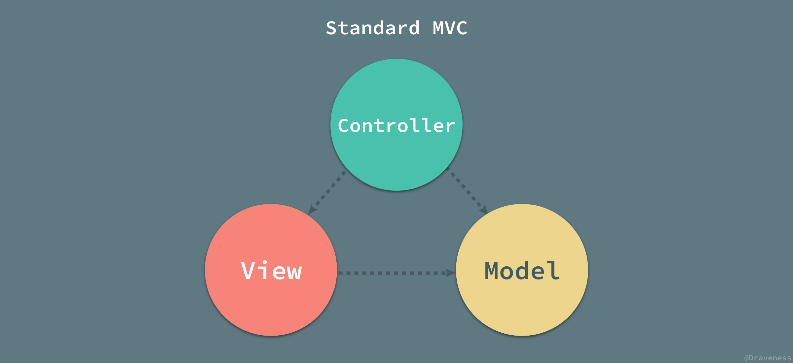
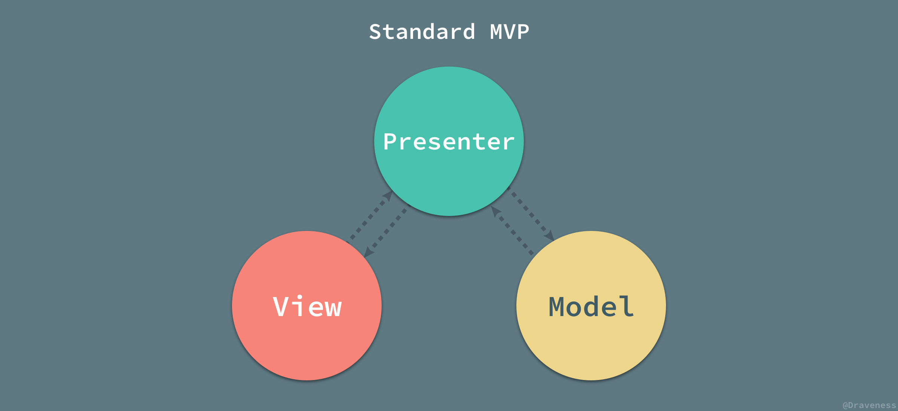

+ 以下所有架构都是视图与数据分离，遵循"关注点分离"的原则。

#### MVC

#### MVP

+ view 很薄
	 p 很重	

#### MVVM

VM 将 M 层中的数据与复杂的业务逻辑封装成属性与简单的数据同时暴露给 V，让 V 和 VM 中的属性进行同步。 

相比presenter，vm更进一步实现同步数据的功能，从代码思想更函数式

#### FLUX

#### 1.主流框架的数据单向/双向绑定实现原理 ?

- Angular1 脏检查：
  - 各种事件会触发$digest，开启脏检查。
  - 计算注册过的数据是否发生变化，第一遍发现有变化，再来一轮检查，直到没有变化位置。
  - 检查发现变化后，触发组件视图刷新。
- vue：
  - 发布-订阅模式
  - 采用Object.defineProperty设置getter和setter方法，进行数据劫持。（递归到所有子属性）
  - 

