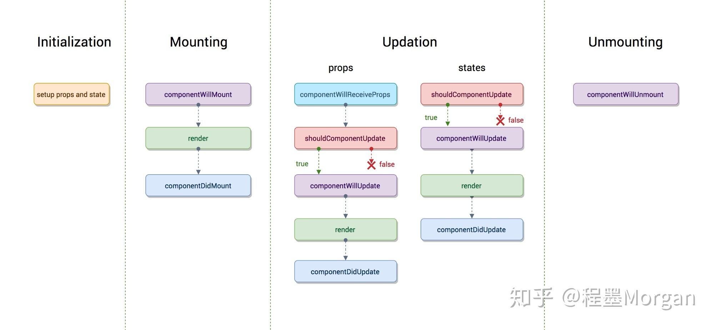
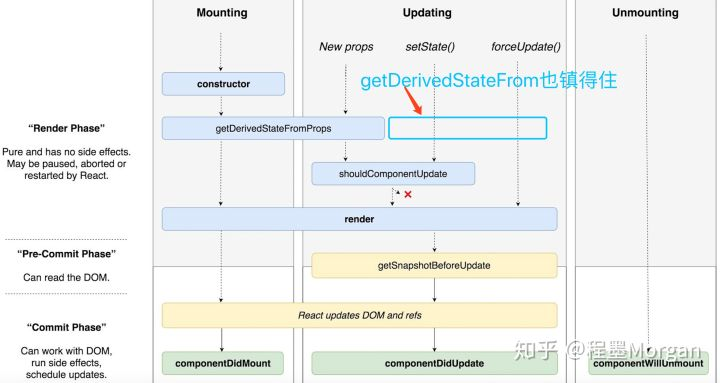

1. react 虚拟DOM 是什么? 如何实现? 

   + Virtural DOM：实际就是使用json表示一个dom tree，然后再利用vdom 生成一个真实的dom。等于在js和dom中间加了一层。因为操作dom开销比操作json的开销大得多。
   + 当需要修改dom时，实现生成一个新的V-DOM，再通过diff算法比较两个V-DOM的差异。
   + 然后将这些差异统一更新到DOM上。
   + V-DOM 节点上的3个属性：tag name，props 和 children。
     

2. 说一下diff算法 ?

   + 常规的两棵树计算最小更新方式的时间复杂度是 O(n^3)，diff算法只有 O(n)。

     + 常规diff：比对差异需要遍历两次（O(n^2)），还需要计算最小转换方式。

   + 策略：

     + 两个不同类型的元素会产生不同的树
     + 对于同一层级的一组子节点，它们可以通过唯一 key 进行区分

   + 算法优化点：

     1. **Tree Diff**：将新旧两颗虚拟 DOM 树,按照层级对应的关系,从头到尾的遍历一遍,,就能找到那些元素是需要更新的

        + 只比对同一层级的节点

        + 如果一节点被移除，则默认其子孙节点也被移除。

     2. **Component Diff**：其实就是比较tag name。
        + 如果类型相同,**暂时**不更新
        + 如果类型不相同,删除旧的组件,再创建一个新的组件,插入到删除组件的那个位置
     3. **Element Diff**：其实就是比较children
        + INSERT_MARKUP（插入）
        +  MOVE_EXISTING（移动）
        +  REMOVE_NODE（删除）

   

3. react 生命周期， v16 和 之前的区别，新加的方法有什么用，有用过吗？

   + 旧生命周期

   

   + tips：
     + componentWillMount：注册事件监听
     + componentDidMount：ajax请求
     + componentWillReceiveProps ：用于修改state（不会引起二次渲染），以及监听props的业务逻辑
     + componentWillUnmount：撤销事件监听

   + 新生命周期

     + 原有的render前的生命周期会被多次调用，例如componentWillMount

     + componentWillMount，componentWillReceiveProps，componentWillUpdate都被getDerivedStateFromProps替代。

     + 具体：

       1. `componentDidCatch(error, info)`：

          如果 `render()` 函数抛出错误，则会触发该函数。

          error为错误message，info包含错误堆栈信息。

       2. `static getDerivedStateFromProps(nextProps, prevState)`：

          无论是Mounting还是Updating，也无论是因为什么引起的Updating，全部都会被调用。它应该返回一个对象来更新状态，或者返回null来不更新任何内容。

       3. `static getSnapshotBeforeUpdate(prevProps, prevState)`：

          被调用于render之后，可以读取但无法使用DOM的时候。它使您的组件可以在可能更改之前从DOM捕获一些信息（例如滚动位置）。此生命周期返回的任何值都将作为参数传递给componentDidUpdate（）。

       

   

4. react HOC 原理，作用，什么情况下会选择用 HOC

   + 属性代理

     ```js
     const HOC = (WrappedComponent) =>
       class WrapperComponent extends Component {
         render() {
           return <WrappedComponent {...this.props} />;
         }
     }
     ```

     + 操作props
     + 获得`refs`的引用
     + 用其他元素包裹组件

   + 反向继承

     ```js
     const HOC = (WrappedComponent) =>
       class extends WrappedComponent {
         render() {
           return super.render();
         }
       }
     ```

     + 渲染劫持

5. Redux-saga 对比 redux-thunk 和 redux-promise 的优势，为什么要引一个这么大的包

   + redux-thunk：模板代码过多

   + redux-promise：payload为promise，resolve和reject都会出发reducer，但payload不同。问题在于无法处理乐观更新。

   + redux-saga：

     + 专门的异步action管理器。

     + 利用generator实现。

     + 能够取消异步流程，容易处理竞态问题。

       

6. 调用 setState 之后发生了什么？
   在代码中调用setState函数之后，React 会将传入的参数对象与组件当前的状态合并，然后触发所谓的调和过程（Reconciliation）。经过调和过程，React 会以相对高效的方式根据新的状态构建 React 元素树并且着手重新渲染整个UI界面。在 React 得到元素树之后，React 会自动计算出新的树与老树的节点差异，然后根据差异对界面进行最小化重渲染。在差异计算算法中，React 能够相对精确地知道哪些位置发生了改变以及应该如何改变，这就保证了按需更新，而不是全部重新渲染。


14. React 中 refs 的作用是什么？ 

15. 在生命周期中的哪一步你应该发起 AJAX 请求？
    我们应当将AJAX 请求放到 componentDidMount 函数中执行，主要原因有下：

    - React 下一代调和算法 Fiber 会通过开始或停止渲染的方式优化应用性能，其会影响到 componentWillMount 的触发次数。对于 componentWillMount 这个生命周期函数的调用次数会变得不确定，React 可能会多次频繁调用 componentWillMount。如果我们将 AJAX 请求放到 componentWillMount 函数中，那么显而易见其会被触发多次，自然也就不是好的选择。
    - 如果我们将 AJAX 请求放置在生命周期的其他函数中，我们并不能保证请求仅在组件挂载完毕后才会要求响应。如果我们的数据请求在组件挂载之前就完成，并且调用了setState函数将数据添加到组件状态中，对于未挂载的组件则会报错。而在 componentDidMount 函数中进行 AJAX 请求则能有效避免这个问题。

16. 传入 setState 函数的第二个参数的作用是什么？

    该函数会在setState函数调用完成并且组件开始重渲染的时候被调用，我们可以用该函数来监听渲染是否完成：

    ```js
    this.setState(
      { username: 'tylermcginnis33' },
      () => console.log('setState has finished and the component has re-rendered.')
    )
    ```

 

16. state和props触发更新的生命周期分别有什么区别
17. emit事件怎么发，需要引入什么
18. 为什么虚拟dom比真实dom性能好
19. 介绍高阶组件，和普通组件有什么区别；
20. React怎么做数据的检查和变化 
21. React中dom结构发生变化后内部经历了哪些变化
22. 介绍react filber；介绍filber结构；画filber渲染树 
23. react异步渲染的概念，介绍Time Slicing和suspense 
24. connect原理；绑定connect的过程 
25. Redux中间件接受几个参数；柯里化函数两端的参数具体是什么东西
26. 中间件是怎么拿到store和action，然后怎么处理

 

 

 

 

 

