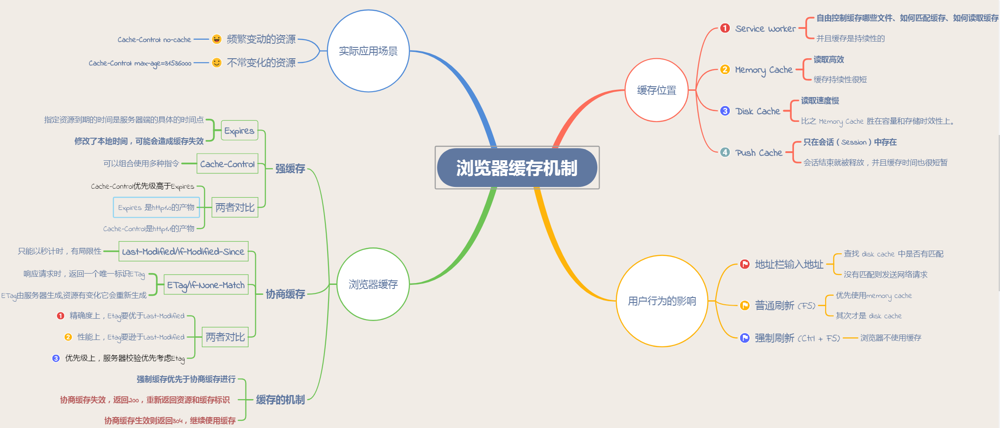

#### 1. 事件模型

+ 标准模型： (1).事件捕获阶段，(2).事件目标阶段，(3).事件冒泡阶段。

+ IE模型： (1).事件冒泡阶段，(2).事件目标阶段，(3).事件捕获阶段 。

  

#### 2. BOM api

+ window.history

+ window.innerHeight/innerWidth  :    viewport 宽高

+ window.location

  + host：主机名称和端口
  + pathname：url路径部分
  + search：？后的字符串
  + href：整个url
  + hash：#后的部分

+ window.navigator:   浏览器信息

+ window.screen：

  + availWidth | 可用的屏幕宽度

  + availHeight | 可用的屏幕宽度

  + width | 当前屏幕宽度 (分辨率)

  + height | 当前屏幕高度 (分辨率值)

  + colorDepth | 当前屏幕色彩深度(bit)

    
    

#### 3. 哪些操作会引起重绘和重排

重绘：**浏览器会根据元素的新属性重新绘制，使元素呈现新的外观** 

重排：

- 添加或删除可见的DOM元素                                                      
- 元素位置改变
- 元素尺寸改变（margin，padding，border，content size）
- 内容改变
- 页面渲染器初始化
- 浏览器尺寸改变

#### 4. 获取页面元素的位置和宽高

只读：

- clientWidth 和 clientHeight：可视区域宽高，padding + content (如果出现滚动条，会减去滚动条宽高)
- offsetWidth 和 offsetHeight：border + padding + content （本身设定，与滚动条等其他信息无关）
- clientTop 和 clientLeft：border的宽度。
- offsetTop 和 offsetLeft：和offset parent的距离。（offset parent指最近一个具有定位属性的父级元素）
- scrollWidth 和 scrollHeight：这两个属性指的是当元素内部的内容超出其宽度和高度的时候，元素内部内容的实际宽度和高度，需要注意的是，当元素其中内容没有超过其高度或者宽度的时候，该属性是取不到的。

可读可写：

- scrollTop 和 scrollLeft：在可视区域内的位置

 

Event对象：

- clientX 和 clientY：鼠标相对浏览器可视区域左上角坐标

- screenX 和 screenY：鼠标相对屏幕左上角坐标

- offsetX 和 offsetY：相对事件源的坐标

- pageX 和 pageY：相对页面的坐标（包括不可见部分）

  

#### 5. 页面性能检测

主要指标：运行时间，内存，FPS

+ 首页加载速度
+ http请求数量

6. js加载顺序

   

   ​	defer 是“渲染完再执行”，async 是“下载完就执行”，defer 如果有多个脚本，会按照在页面中出现的顺序加载，多个async 脚本不能保证加载顺序

   ​	加载 es6模块的时候设置 type=module，异步加载不会造成阻塞浏览器，页面渲染完再执行，可以同时加上async属性，异步执行脚本（利用顶层的this等于undefined这个语法点，可以侦测当前代码是否在 ES6 模块之中）


####  6. **URL到看到页面发生的全过程**  （[地址](https://segmentfault.com/a/1190000013522717?utm_source=tag-newest)）

1. 浏览器主进程接管，打开一个下载线程。
2. DNS，通过域名查找对应的web 服务器ip地址和端口；
   + 浏览器缓存
   + 操作系统缓存
   + host文件
   + 路由器缓存
   + 互联网服务提供商的DNS服务
   + 顶级DNS服务器
3. 发起一个HTTP get请求：

　这里涉及到客户端与服务器的tcp 三次握手与四次挥手，可以参考上篇博文《[TCP的三次握手(建立连接）与 四次挥手(关闭连接）](http://www.cnblogs.com/CandyManPing/p/6626661.html)》；

+ 三次握手：
  + client 发起一个标志位SYN：1 和 Seq: 随机数 X 给server   （用于发起一次连接）
  + server发送标志位SYN:1、ACK: 1、ack: X + 1 和 Seq： 随机数K    （用于client确认server准备完成）
  + client 发送ACK: 1、ack: K + 1    (用于server 确认client 准备好了)

5. 服务器通过url和报文内容处理完成返回html;

   

6. 浏览器Renderer进程开始html解析

   解析html 构建dom树 -> 构建render树 -> 布局render树 -> 绘制render树 ：

   + 从上至下开始解析html，遇到link , script, img等标签会开启线程下载这些内容；

   ```
   1、将HTML构建成一个DOM树，DOM 树的构建过程是一个深度遍历过程：当前节点的所有子节点都构建好后才会去构建当前节点的下一个兄弟节点。 
   2、将CSS解析成CSS去构造CSSOM ( CSSOM = CSS Object Model CSS对象模型)
   3、根据DOM树和CSSOM来构造 Rendering Tree（渲染树）。注意：Rendering Tree 渲染树并不等同于 DOM 树，因为一些像 Header 或 display:none 的东西就没必要放在渲染树中了。
   
   4.有了Render Tree，浏览器已经能知道网页中有哪些节点、各个节点的CSS定义以及他们的从属关系。
   5.下一步操作称之为Layout，顾名思义就是计算出每个节点在屏幕中的位置 layout render tree。 
   6.再下一步就是绘制，即遍历render树，并使用浏览器UI后端层绘制每个节点。
   
   ```

7. 关闭连接：

   TCP四次挥手（双工通信，所以必须确认两端都关闭）：

   - client 发送 FIN： 1 和 Seq: 随机数X 给server    (通知server client准备关闭连接)
   - server 发送 ACK : 1 和 ack： X + 1 给client （同意client关闭连接）
   - server 发送 FIN： 1 和 Seq： 随机数K 给client （同client 准备关闭连接）
   - client 发送 ACK : 1 和 ack： K + 1 给server（同意server关闭连接）

　　

#### 7. 性能优化中重绘、重排： 
（1）Reflow（回流/重排）：当它发现了某个部分发生了变化影响了布局，渲染树需要重新计算。 
（2）Repaint（重绘）：改变了某个元素的背景颜色，文字颜色等，不影响元素周围或内部布局的属性，将只会引起浏览器的repaint，根据元素的新属性重新绘制，使元素呈现新的外观。重绘不会带来重新布局，并不一定伴随重排；
Reflow要比Repaint更花费时间，也就更影响性能。所以在写代码的时候，要尽量避免过多的Reflow。

reflow的原因：

（1）页面初始化的时候； 
（2）操作DOM时； 
（3）某些元素的尺寸变了； 
（4）如果 CSS 的属性发生变化了。

减少 reflow/repaint

　（1）不要一条一条地修改 DOM 的样式。与其这样，还不如预先定义好 css 的 class，然后修改 DOM 的 className。 
　（2）不要把 DOM 结点的属性值放在一个循环里当成循环里的变量。 
　（3）为动画的 HTML 元件使用 fixed 或 absoult 的 position，那么修改他们的 CSS 是不会 reflow 的。 
　（4）千万不要使用 table 布局。因为可能很小的一个小改动会造成整个 table 的重新布局。

#### 8. iframe的问题：

+ 显示区大小不容易控制
+ url记录无效，浏览器回退缓存机制无效。
+ 样式，兼容性有问题。
+ 性能开销，iframe加载时会阻塞主页面onload。

#### 9. MessageChannel

```js
        var channel = new MessageChannel();
        var port1 = channel.port1;
        var port2 = channel.port2;
        port1.onmessage = function(event) {
            console.log("port1收到来自port2的数据：" + event.data);
        }
        port2.onmessage = function(event) {
            console.log("port2收到来自port1的数据：" + event.data);
        }

        port1.postMessage("发送给port2");
        port2.postMessage("发送给port1");
```

+ 实例为一个管道，port为管道的两个端口。
+ 管道中传递的是深拷贝数据。
+ 


#### 10. 说一下浏览器的缓存机制



[img link](https://upload-images.jianshu.io/upload_images/3174701-8e74b69ad9376710)

+ #####	强缓存

  + Expires： Expires=max-age + 请求时间，需要和Last-modified结合使用。
  + cache-control：
    + public：所有内容都将被缓存（客户端和代理服务器都可缓存）
    + private：所有内容只有客户端可以缓存
    + no-cache：不使用强缓存
    + no-store：即不使用强制缓存，也不使用协商缓存
    + max-age： max-age=xxx (xxx is numeric)表示缓存内容将在xxx秒后失效

+ ##### 协商缓存

  + 协商缓存就是强制缓存失效后，浏览器携带缓存标识向服务器发起请求，由服务器根据缓存标识决定是否使用缓存的过程，主要有以下两种情况：
    + 协商缓存生效，返回304和Not Modified
    + 协商缓存失效，返回200和请求结果

  +  Last-Modified和If-Modified-Since

    浏览器在第一次访问资源时，服务器返回资源的同时，在response header中添加 Last-Modified的header，值是这个资源在服务器上的最后修改时间，浏览器接收后缓存文件和header；

    ```css
    Last-Modified: Fri, 22 Jul 2016 01:47:00 GMT
    ```

    浏览器下一次请求这个资源，浏览器检测到有 Last-Modified这个header，于是添加If-Modified-Since这个header，值就是Last-Modified中的值；

    服务器再次收到这个资源请求，会根据 If-Modified-Since 中的值与服务器中这个资源的最后修改时间对比，如果没有变化，返回304和空的响应体，直接从缓存读取，如果If-Modified-Since的时间小于服务器中这个资源的最后修改时间，说明文件有更新，于是返回新的资源文件和200

    但是 Last-Modified 存在一些弊端：

    - 如果本地打开缓存文件，即使没有对文件进行修改，但还是会造成 Last-Modified 被修改，服务端不能命中缓存导致发送相同的资源
    - 因为 Last-Modified 只能以秒计时，如果在不可感知的时间内修改完成文件，那么服务端会认为资源还是命中了，不会返回正确的资源

  + ETag和If-None-Match

    Etag是服务器响应请求时，返回当前资源文件的一个唯一标识(由服务器生成)，只要资源有变化，Etag就会重新生成。

  

##### 11. 列举三种禁止浏览器缓存的头字段，并写出响应的设置值

+ Expires：告诉浏览器把回送的资源缓存多长时间 -1或0则是不缓存 

简要：添加Expires头能有效的利用浏览器的缓存能力来改善页面的性能，能在后续的页面中有效避免很多不必要的Http请求，WEB服务器使用Expires头来告诉Web客户端它可以使用一个组件的当前副本，直到指定的时间为止。 例如：Expires：Thu，15 Apr 2010 20：00：00 GMT; 他告诉浏览器缓存有效性持续到2010年4月15日为止，在这个时间之内相同的请求使用缓存，这个时间之外使用http请求。

+ Cache-Control：no-cache 

  Cathe-Control：max-age=315360000

Expires有一个非常大的缺陷，它使用一个固定的时间，要求服务器与客户端的时钟保持严格的同步，并且这一天到来后，服务器还得重新设定新的时间。 HTTP1.1引入了Cathe-Control，它使用max-age指定组件被缓存多久，从请求开始在max-age时间内浏览器使用缓存，之外的使用请求，这样就可以消除Expires的限制， 如果对浏览器兼容性要求很高的话，可以两个都使用。

Pragma：no-cache

#### 12. createDocementFragment

用来创建一个虚拟的节点对象，当把一个DocumentFragment节点插入文档树时，插入的不是DocumentFragment自身，而是它的所有子孙节点，即插入的是括号里的节点。


### 13. 前端如何进行seo优化

- 合理的title、description、keywords：搜索对着三项的权重逐个减小，title值强调重点即可；description把页面内容高度概括，不可过分堆砌关键词；keywords列举出重要关键词。
- 语义化的HTML代码，符合W3C规范：语义化代码让搜索引擎容易理解网页
- 重要内容HTML代码放在最前：搜索引擎抓取HTML顺序是从上到下，保证重要内容一定会被抓取
- 重要内容不要用js输出：爬虫不会执行js获取内容
- 少用iframe：搜索引擎不会抓取iframe中的内容
- 非装饰性图片必须加alt
- 提高网站速度：网站速度是搜索引擎排序的一个重要指标


14. IndexDB，HTTP/2 或 Service Workers 

15. Fetch API 相对于传统的 Ajax 有哪些改进？

16. 使用单页应用将文件上传到服务器的有哪些方法

    提示：XMLHttpRequest2（streaming），fetch（non-streaming），File API

 


17. **XSS 与 CSRF 两种跨站攻击**

    1. xss 跨站脚本攻击，主要是前端层面的，用户在输入层面插入攻击脚本，改变页面的显示，或则窃取网站 cookie，预防方法：不相信用户的所有操作，对用户输入进行一个转义，不允许 js 对 cookie 的读写
    2. csrf 跨站请求伪造，以你的名义，发送恶意请求，通过 cookie 加参数等形式过滤
    3. 我们没法彻底杜绝攻击，只能提高攻击门槛

18. **网站性能优化**

    1. http 请求方面，减少请求数量，请求体积，对应的做法是，对项目资源进行压缩，控制项目资源的 dns 解析在2到4个域名，提取公告的样式，公共的组件，雪碧图，缓存资源，
    2. 压缩资源，提取公共资源压缩，提取 css ，js 公共方法
    3. 不要缩放图片，使用雪碧图，使用字体图表（阿里矢量图库）
    4. 使用 CDN，抛开无用的 cookie
    5. 减少重绘重排，CSS属性读写分离，最好不要用js 修改样式，dom 离线更新，渲染前指定图片的大小
    6. js 代码层面的优化，减少对字符串的计算，合理使用闭包，首屏的js 资源加载放在最底部  


19. 提高首屏加载速度

    + js外联文件放到body底部，css外联文件放到head内 

    + http静态资源尽量用多个子域名 

    + 服务器端提供html和http静态资源时最好开启gzip 

    + 在js,css,img等资源响应的http headers里设置expires,last-modified 

    + 尽量减少http requests的数量 

    + js/css/html/img资源压缩 

    + 使用css spirtes，可以减少img请求次数 

    + 大图使用lazyload懒加载 

    + 避免404，减少外联js 

    + 减少cookie大小可以提高获得响应的时间 

      


​    

​    

​    